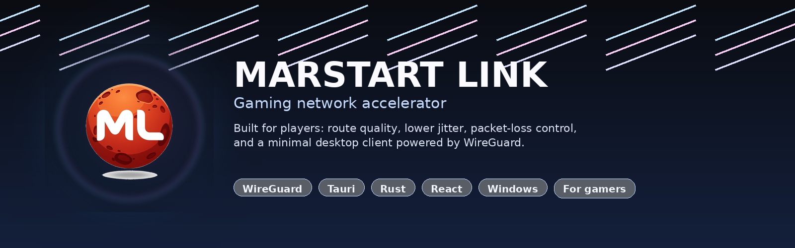
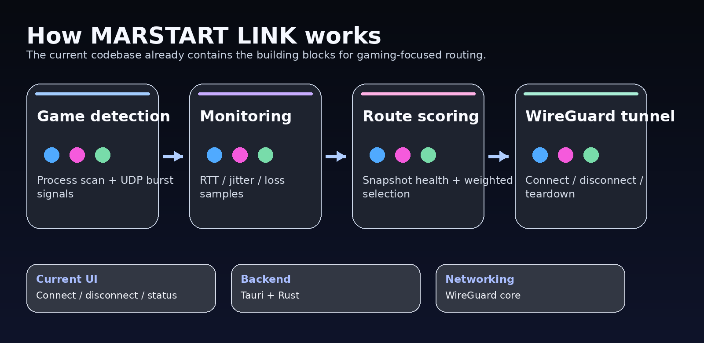

# MARSTART LINK

<p align="center">
  
</p>

<p align="center">
  <a href="#русская-версия">Русский</a> · <a href="#english-version">English</a>
</p>

<p align="center">
  
  
  
  
  
</p>

---

# Русская версия

## Что такое MARSTART LINK

**MARSTART LINK** — это не обычный VPN-клиент.  
Это игровое сетевое приложение, которое собрано вокруг одной цели: сделать соединение с игровыми серверами более стабильным, предсказуемым и удобным для игрока.

Проект ориентирован на сценарии, где важны:

- низкий ping;
- минимальный jitter;
- меньше потерь пакетов;
- стабильный маршрут;
- быстрый старт в один клик;
- удобный контроль подключения без лишней сложности.

<p align="center">
  
</p>

## Что уже есть в коде

Сейчас в проекте уже присутствуют такие части:

- Tauri-приложение для Windows;
- React + TypeScript frontend;
- Rust backend;
- управление WireGuard-туннелем;
- команды `connect`, `disconnect`, `get_status`;
- профили подключения;
- мониторинг RTT, jitter и packet loss;
- сборка и хранение метрик в `MetricsStore`;
- snapshot-логика для оценки качества маршрута;
- route scoring и выбор лучшего маршрута;
- load balancing по flow key;
- autopilot-логика на основе состояния сети;
- game detection по процессам и UDP burst-сигналам;
- multipath header / каркас для будущей мультипутевой логики;
- Windows-иконки и пакетирование приложения.

## Что это означает на практике

Проект уже вышел за рамки “просто VPN”.  
В кодовой базе есть задел на игровую платформу маршрутизации:

- определение игровой активности;
- наблюдение за качеством канала;
- сравнение маршрутов;
- выбор более стабильного пути;
- подготовка к более умному переключению маршрутов.

## Что сейчас видно пользователю

На текущем этапе интерфейс остаётся простым и минимальным:

- подключение;
- отключение;
- текущий статус туннеля.

То есть backend уже гораздо богаче, чем UI.  
Это нормально для проекта на ранней стадии, но в README лучше честно разделять “уже в коде” и “пока в интерфейсе”.

## Что ещё не закончено

По текущему состоянию кода не выглядит завершённым следующее:

- полноценный multilingual UI внутри приложения;
- экран выбора серверов / маршрутов;
- полноценная панель диагностики;
- графики по ping / jitter / loss;
- автоматический выбор региона;
- полноценный пользовательский профильный мастер;
- готовая маркетинговая витрина внутри клиента.

Это не минус. Это просто текущая стадия проекта.

## Технологии

- **Frontend:** React, TypeScript, Vite
- **Backend:** Rust, Tauri
- **Network core:** WireGuard
- **Target platform:** Windows 10 / 11

## Требования и ограничения

Для работы MARSTART LINK требуются права **Administrator** (приложение помечено
`requireAdministrator` в манифесте `src-tauri/src-tauri.manifest`), установленный
драйвер **WireGuard-NT** (библиотека `wireguard.dll` берётся из `src-tauri/resources/`),
а также активное WireGuard‑соединение.

> **Ограничение:** полная проверка работы в реальном Windows‑окружении в текущей
> среде сборки **не выполнена** — здесь нет прав администратора, тестовых
> конфигураций WireGuard и активной WireGuard‑инфраструктуры.
> **Реальный Windows runtime gate: ЗАБЛОКИРОВАН.** Принятая архитектура
> (Option A) не изменена и намеренно не ослаблена из‑за этого.

## Сборка и запуск

### Установка зависимостей

```bash
npm install
```

### Режим разработки

```bash
npm run tauri:dev
```

### Production build

```bash
npm run tauri:build
```

## Позиционирование проекта

MARSTART LINK — это игровое сетевое приложение для игроков.  
Не обычный VPN. Не корпоративный туннель. Не универсальный прокси.  
Основная задача проекта — помочь игровому трафику идти по более стабильному и менее проблемному маршруту.

## Дорожная карта

- полноценный выбор маршрута и региона;
- UI с игровыми профилями;
- мониторинг соединения в реальном времени;
- более умная autopilot-логика;
- расширенная статистика качества линии;
- мультисерверная и мультипутевая схема;
- улучшенная визуальная панель для игроков.

## Визуальный стиль

Логотип и оформление основаны на новом бренде **MARSTART LINK**.  
В README уже используется баннер и архитектурная схема, чтобы страница выглядела как продукт, а не как сырая техническая заметка.

---

# English version

## What MARSTART LINK is

**MARSTART LINK** is not a standard VPN client.  
It is a gaming network application built around one goal: make the connection to game servers more stable, more predictable, and more player-friendly.

The project is designed for scenarios where the following matter:

- lower ping;
- minimal jitter;
- fewer packet drops;
- stable routing;
- fast one-click connection;
- simple control without extra noise.

<p align="center">
  
</p>

## What is already in the codebase

The current code already includes:

- a Windows desktop app built with Tauri;
- a React + TypeScript frontend;
- a Rust backend;
- WireGuard tunnel management;
- `connect`, `disconnect`, and `get_status` commands;
- connection profiles;
- RTT, jitter, and packet-loss monitoring;
- metric collection through `MetricsStore`;
- snapshot-based route health evaluation;
- route scoring and best-route selection;
- flow-based load balancing;
- autopilot logic driven by network state;
- game detection based on processes and UDP burst signals;
- a multipath header / scaffold for future multipath work;
- Windows icons and packaging support.

## What that means in practice

The project already goes beyond “just a VPN”.  
The codebase contains the foundations of a gaming routing platform:

- game activity detection;
- live connection quality observation;
- route comparison;
- selection of a more stable path;
- groundwork for smarter route switching.

## What the user currently sees

At the moment the UI is still intentionally simple:

- connect;
- disconnect;
- tunnel status.

So the backend is much richer than the UI right now.  
That is fine for an early-stage project, but the README should clearly separate “already implemented in code” from “available in the interface”.

## What is still incomplete

Based on the current state of the code, the following does not look fully finished yet:

- full multilingual UI inside the app;
- route / server selection screen;
- complete diagnostics dashboard;
- ping / jitter / loss charts;
- automatic region selection;
- a polished onboarding flow;
- a full product-style in-app storefront experience.

That is not a problem. It is just the current stage of the project.

## Tech stack

- **Frontend:** React, TypeScript, Vite
- **Backend:** Rust, Tauri
- **Network core:** WireGuard
- **Target platform:** Windows 10 / 11

## Requirements & runtime limitations

Running MARSTART LINK requires **Administrator** privileges (the app is marked
`requireAdministrator` in `src-tauri/src-tauri.manifest`), the **WireGuard-NT**
driver (`wireguard.dll`, bundled under `src-tauri/resources/`), and an active
WireGuard tunnel.

> **Limitation:** a full end-to-end runtime validation on real Windows has
> **not** been completed in the current build environment — it lacks Administrator
> privileges, WireGuard test configurations/endpoints, and active WireGuard
> runtime infrastructure.
> **REAL WINDOWS RUNTIME GATE: BLOCKED.** The approved architecture (Option A)
> is unchanged and intentionally not weakened because of this.

### Release signing

The Tauri production bundle is cryptographically signed. The signing key
is referenced in CI via the GitHub Actions secret named
**`TAURI_SIGNING_PRIVATE_KEY`** (base64-encoded contents of `tauri.key`).

The `release.yml` workflow currently maps the older `TAURI_PRIVATE_KEY`
env name; the `tauri-apps/tauri-action` automatically forwards
`TAURI_PRIVATE_KEY` → `TAURI_SIGNING_PRIVATE_KEY`. After the CR-1 key
rotation the owner must populate **`TAURI_SIGNING_PRIVATE_KEY`** with the
new key contents. The new key was generated **without** a password; if
`TAURI_SIGNING_PRIVATE_KEY_PASSWORD` is referenced in CI, set it to an
empty string or remove it.

> **Security:** `tauri.key` and `tauri.key.pub` are listed in `.gitignore`
> and have been purged from all reachable Git history (post-GC verified).
> The private key is never committed.

**Current release version:** v0.1.1 (matches `package.json`, `Cargo.toml`,
`tauri.conf.json`, and `Cargo.lock`).

## Development

### Install dependencies

```bash
npm install
```

### Development mode

```bash
npm run tauri:dev
```

### Production build

```bash
npm run tauri:build
```

## Product positioning

MARSTART LINK is a gaming network application for players.  
Not a generic VPN. Not an enterprise tunnel. Not a universal proxy.  
The purpose of the project is to help game traffic follow a more stable and less problematic path.

## Roadmap

- full route and region selection;
- gaming profiles in the UI;
- real-time connection monitoring;
- smarter autopilot behavior;
- richer line-quality statistics;
- multi-server and multipath architecture;
- a stronger visual dashboard for players.

## Visual style

The new **MARSTART LINK** branding is already reflected in the README through a banner and an architecture graphic, so the project looks like a real product rather than a raw technical note.

---

## License

Private project.
